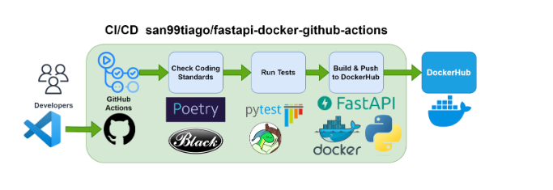

# python-CICD-fastapi-basic
<i>python-fastapi-basic-CICD

- Reference : <i>https://github.com/san99tiago/fastapi-docker-github-actions/tree/main/.github/workflows</i>


FastAPI is a modern, fast (high-performance), web framework for building APIs with Python 3.8+ based on standard Python type hints.

The key features are:

- Fast: Very high performance, on par with NodeJS and Go (thanks to Starlette and Pydantic). One of the fastest Python frameworks available.
- Fast to code: Increase the speed to develop features by about 200% to 300%. *
- Fewer bugs: Reduce about 40% of human (developer) induced errors. *
- Intuitive: Great editor support. Completion everywhere. Less time debugging.
- Easy: Designed to be easy to use and learn. Less time reading docs.
- Short: Minimize code duplication. Multiple features from each parameter declaration. Fewer bugs.
- Robust: Get production-ready code. With automatic interactive documentation.
- Standards-based: Based on (and fully compatible with) the open standards for APIs: OpenAPI (previously known as Swagger) and JSON Schema.


### Install Poerty
```
https://python-poetry.org/docs/?ref=dylancastillo.co#installing-with-the-official-installer
```


### Using Python Virtual Environment
```bash
python -m venv .venv
source .venv/bin/activate
```


### Using Poetry: Create the virtual environment in the same directory as the project and install the dependencies:
```bash
poetry config virtualenvs.in-project true
poetry init
poetry add fastapi
poetry add uvicorn
poetry add pytz
poetry add httpx
poetry add pytest
poetry add pytest-cov
poetry add requests
poetry add pyyaml
poetry add elasticsearch==7.13
poetry add python-dotenv
```


### Pytest
- Go to virtual enviroment using `source .venv/bin/activate`
- Run this command manually: `poetry run py.test -v --junitxml=test-reports/junit/pytest.xml --cov-report html --cov tests/` or `./pytest.sh`
```bash
➜  python-CICD-fastapi-basic git:(master) ✗ ./pytest.sh
================================================ test session starts ================================================
platform darwin -- Python 3.9.7, pytest-7.0.1, pluggy-0.13.1 -- /Users/euiyoung.hwang/opt/anaconda3/bin/python
cachedir: .pytest_cache
rootdir: /Users/euiyoung.hwang/ES/Python_Workspace/python-CICD-fastapi-basic/tests, configfile: pytest.ini
plugins: anyio-3.6.1, mock-3.6.1, cov-4.0.0
collected 1 item                                                                                                    

tests/test_api.py::test_api PASSED                                                                            [100%]

================================================= 1 passed in 0.05s =================================================
➜  python-CICD-fastapi-basic git:(master) ✗ source .venv/bin/activate
(.venv) ➜  python-CICD-fastapi-basic git:(master) ✗ ./pytest.sh              
================================================ test session starts ================================================
platform darwin -- Python 3.9.7, pytest-7.0.1, pluggy-0.13.1 -- /Users/euiyoung.hwang/opt/anaconda3/bin/python
cachedir: .pytest_cache
rootdir: /Users/euiyoung.hwang/ES/Python_Workspace/python-CICD-fastapi-basic/tests, configfile: pytest.ini
plugins: anyio-3.6.1, mock-3.6.1, cov-4.0.0
collected 1 item                                                                                                    

tests/test_api.py::test_api PASSED                                                                            [100%]

================================================= 1 passed in 0.12s =================================================
(.venv) ➜  python-CICD-fastapi-basic git:(master) ✗ 
```


### CI/CD Environment
- CircleCI (`./circleci/config.yml`): CircleCI is a continuous integration and continuous delivery platform that helps software teams work smarter, faster. With CircleCI, every commit kicks off a new job in our platform, and code is built, tested, and deployed. 
- Github Actions (`./.github/workflows/build-and-test.yml`) : GitHub Actions is a continuous integration and continuous delivery (CI/CD) platform that allows you to automate your build, test, and deployment pipeline. You can create workflows that build and test every pull request to your repository, or deploy merged pull requests to production.


### Slack for alert through Github Actions
- Slack for app (<i>https://velog.io/@devand/%EC%8A%AC%EB%9E%99-Web-API-%EB%A5%BC-%EC%9D%B4%EC%9A%A9%ED%95%B4%EB%B3%B4%EC%9E%90-1</i>)
- create app to slack (https://api.slack.com/apps)
- Permission for new app user : Features > OAuth & Permissions (incoming-webhook, chat:write, groups:write for secrets)
```bash
curl -X POST -H 'Content-type: application/json' --data '{"text":"Hello, World!"}' <slack incomming URL>
```
- Slack alerts from master branch
```bash
# Failure
euiyounghwangeuiyounghwang
Workflow Build and Test job build-tests triggered by push is FAILURE for master
1d035a00 - 1 commits
Job Steps
:heavy_check_mark: fe3a7aab5c294ff1bb4920e7f3615586
:heavy_check_mark: Build-Poetry
:heavy_check_mark: Test-Postgres
:heavy_check_mark: Test-Redis
:heavy_check_mark: Install-Elasticsearch
:x: Run-Elasticsearch
:no_entry_sign: Test-Elasticsearch
:no_entry_sign: Build-tests
<https://github.com/euiyounghwang/python-CICD-fastapi-basic|euiyounghwang/python-CICD-fastapi-basic> 
#163euiyounghwang/python-CICD-fastapi-basic #163 | Today at 11:28 PM

# Success
euiyounghwangeuiyounghwang
Workflow Build and Test job alert triggered by push is SUCCESS for master
93e61e9c - 1 commits
<https://github.com/euiyounghwang/python-CICD-fastapi-basic|euiyounghwang/python-CICD-fastapi-basic> #164euiyounghwang/python-CICD-fastapi-basic #164 | Today at 11:32 PM
```

### Git Branch
- git branch -D SEARCH-476
- git push origin --delete SEARCH-476